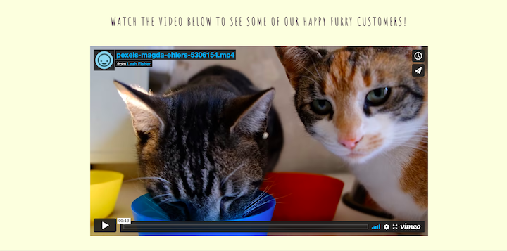

# Holly & Ruby Cat Sitting Services

My website is designed to offer information about a local cat sitting service in South Wales. It contains essential information about the business, locations covered, services provided and prices. It also features a contact page with a form to allow users to enquire further about specific dates and requirements.

<a href="https://cornishcoder1.github.io/project1-cat-sitting-services/" target="_blank" rel="noopener" aria-label="Link to open deployed site">Link to deployed site</a>

------

## UX

My website is aimed at cat owners who are looking for a cat sitting service for the first time, or to those looking for an alternative to placing their pet in a cattery while they are away. I have attempted to keep the website quite clean and clutter free, but also wanted to ensure that all essential information is present. The color scheme consists of #FEFEDF applied to header, footer, alternate sections on the homepage and text boxes, and #4E4351 as a main background color. The text is a darker variation of the purple background color. I generated a number of color palettes by using <a href="https://mycolor.space/?hex=%23845EC2&sub=1>">ColorSpace</a>. The main color I generated the palettes from was #845EC2. I wanted the design of the site to reflect a fun and playful feeling which comes with having a pet such as a cat, whilst also using colors and fonts which would give a modern and stylish finish.

Wireframes for desktop site:

Home Page

About Us Page

Prices Page

Contact Us Page

Confirmation Page

## User Stories

As a new user I am:
- looking for information about cat sitting services in my local area.
- wanting to know a little bit about the business and their background.
- get an indication of prices, and be able to contact the business with any further enquiries about availability and the services I require.

As an existing user I am: 
- Looking to get in touch with the business to enquire and/or re-book services which I have used before. 
- Checking current prices and availabilty 

------

## Features 

Navigation Bar and Footer

Hero Section

Video Section

Icon Section

About Us Page

Prices Page

Contact Us and Confirmation Pages

Features left to implement

------

## Technologies used

Insert here

------

## Testing

1. Validator testing
2. Unfixed bugs

------

## Deployment 

Insert here

------

## Credit 

1. Content (references)

2. Media (images)
    
Cat paw heart and clock icons made by <a href="https://www.freepik.com" title="Freepik">Freepik</a> from <a href="https://www.flaticon.com/" title="Flaticon">www.flaticon.com</a>

    
First aid bag icon made by <a href="https://www.flaticon.com/authors/catkuro" title="catkuro">catkuro</a> from <a href="https://www.flaticon.com/" title="Flaticon">www.flaticon.com</a>

    
Police officer with badge icon made by <a href="https://www.flaticon.com/authors/eucalyp" title="Eucalyp">Eucalyp</a> from <a href="https://www.flaticon.com/" title="Flaticon">www.flaticon.com</a>

     
3. Acknowledgements (Love Running, mentor etc)
