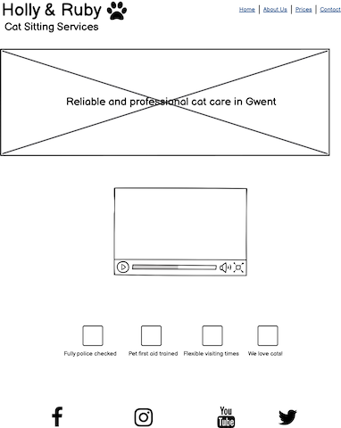
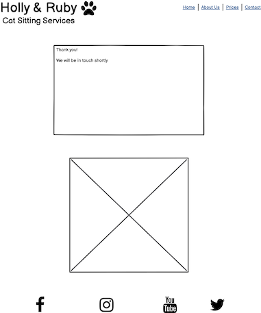
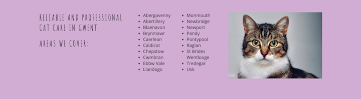
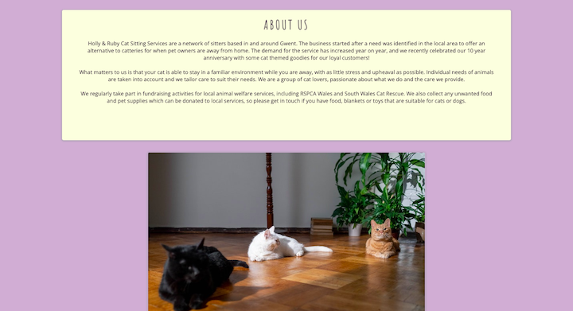
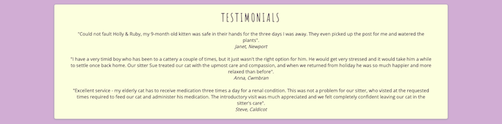
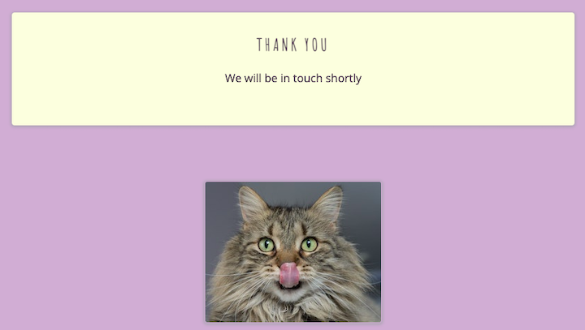

# Holly & Ruby Cat Sitting Services

My website is designed to offer information about a local cat sitting service in South Wales. It contains essential information about the business, locations covered, services provided and prices. It also features a contact page with a form to allow users to enquire further about specific dates and requirements.

<a href="https://cornishcoder1.github.io/project1-cat-sitting-services/" target="_blank" rel="noopener" aria-label="Link to open deployed site">Link to deployed site</a>

------

## UX

My website is aimed at cat owners who are looking for a cat sitting service for the first time, or to those looking for an alternative to placing their pet in a cattery while they are away. I have attempted to keep the website quite clean and clutter free, but also wanted to ensure that all essential information is present. The color scheme consists of #FEFEDF applied to header, footer, alternate sections on the homepage and text boxes, and #4E4351 as a main background color. The text is a darker variation of the purple background color. I generated a number of color palettes by using <a href="https://mycolor.space/?hex=%23845EC2&sub=1>">ColorSpace</a>. The main color I generated the palettes from was #845EC2. I wanted the design of the site to reflect a fun and playful feeling which comes with having a pet such as a cat, whilst also using colors and fonts which would give a modern and stylish finish.

Wireframes for desktop site:

Home Page

About Us Page

Prices Page

Contact Us Page

Confirmation Page

## User Stories

As a new user I am:
- looking for information about cat sitting services in my local area.
- wanting to know a little bit about the business and their background.
- get an indication of prices, and be able to contact the business with any further enquiries about availability and the services I require.

As an existing user I am: 
- Looking to get in touch with the business to enquire and/or re-book services which I have used before. 
- Checking current prices and availabilty 

------

## Features 

Navigation Bar and Footer

The navigation bar and footer are featured on every page of the site. The former allows users to easily navigate to whichever part of the site they wish. An "a:hover" line appears under each link when the user hovers over with the mouse. The footer allows users to navigate to the relevant would-be social media channels for the business. 

Hero Section

This section contains the headline of "Reliable and Affordable Cat Care in Gwent", giving the user a clear list of areas covered as soon as they land on the site. I've attempted to make the homepage as inviting and visually pleasing as possible with the use of the cat photo, video and playful icons.  

Video Section

This section features a stock video from Pexels, showing cats during a fictional feeding time during a home visit. This video is not set to auto-play, allowing users to initiate and control actions on the video player.

Icon Section

I wanted this section to be a visually appealing section highlighting very succinctly why customers should choose this business. it highlights important features of the business and it's ethos in an easy to digest and attractive way.

About Us Page

This page contains the bulk of the information about the business, split into three easy to read sections which are broken up with images. It clear states some of the business background and demonstrates enthusiasm for what they do, information on the benefits of cat sitting and testimonials from happy customers. These testimonials provided some added reassurance to the user that their pet would be in safe hands. 

Prices Page

This page gives information about standard pricing in a table, which is clearly presented and easy to read. It also provides information on cancellation and how to make payment. 

Contact Us and Confirmation Pages

The Contact Us page contains a form element, which allows users to get in touch with the business. All fields (apart from the message field) are set as required which ensures all information is collected before the user can submit the form. The form allows users to specify the dates during which they require cat sitting services, number of cats to be cared for and gives the opportunity to ask specific questions within the message field. When the user clicks the submit button they are then presented with a confirmation page which informs them that they will be contacted soon. 

## Features left to implement

I would like to expand on the interactivity of the site, perhaps implementing a fully functioning booking system which would allow users to select dates, times etc. and make payment in one seamless transaction. It would also be good to have a blog page, featuring articles on business news and cat care to help drive traffic to the site and generate interest in the business. 

------

## Technologies used

- HTML
- CSS
- Gitpod
- GitHub

## Other resources used

<a href="http://ami.responsivedesign.is/#"> - Am I Responsive</a>

<a href="https://balsamiq.com"> - Balsamiq</a>

<a href="https://developer.chrome.com/docs/devtools"> - Chrome Dev Tools</a>

<a href="https://mycolor.space/?hex=%23845EC2&sub=1>"> - ColorSpace</a>

<a href="http://www.flaticon.com/"> - Flaticon</a>

<a href="https://fontawesome.com/"> - Font Awesome</a>

<a href="https://fonts.google.com/"> - Google Fonts</a>

<a href="https://pexels.com"> - Pexels</a>

<a href="https://unsplash.com"> - Unsplash</a>

<a href="https://vimeo.com"> - Vimeo</a>

------

# Validator Testing

## HTML

<a href="https://validator.w3.org/nu/?doc=https%3A%2F%2Fcornishcoder1.github.io%2Fproject1-cat-sitting-services%2F"> index.html - 1 warning</a>

<a href="https://validator.w3.org/nu/?doc=https%3A%2F%2Fcornishcoder1.github.io%2Fproject1-cat-sitting-services%2F"> about.html - </a>

<a href="https://validator.w3.org/nu/?doc=https%3A%2F%2Fcornishcoder1.github.io%2Fproject1-cat-sitting-services%2F"> prices.html - </a>

<a href="https://validator.w3.org/nu/?doc=https%3A%2F%2Fcornishcoder1.github.io%2Fproject1-cat-sitting-services%2F"> contact.html - </a>

<a href="https://validator.w3.org/nu/?doc=https%3A%2F%2Fcornishcoder1.github.io%2Fproject1-cat-sitting-services%2F"> confirmation.html - </a>

2. Unfixed bugs

------

## Deployment 

Insert here

------

## Credit 

1. Content (references)

2. Media (images)
    
Cat paw heart and clock icons made by <a href="https://www.freepik.com" title="Freepik">Freepik</a> from <a href="https://www.flaticon.com/" title="Flaticon">www.flaticon.com</a>

    
First aid bag icon made by <a href="https://www.flaticon.com/authors/catkuro" title="catkuro">catkuro</a> from <a href="https://www.flaticon.com/" title="Flaticon">www.flaticon.com</a>

    
Police officer with badge icon made by <a href="https://www.flaticon.com/authors/eucalyp" title="Eucalyp">Eucalyp</a> from <a href="https://www.flaticon.com/" title="Flaticon">www.flaticon.com</a>

     
3. Acknowledgements (Love Running, mentor etc)
